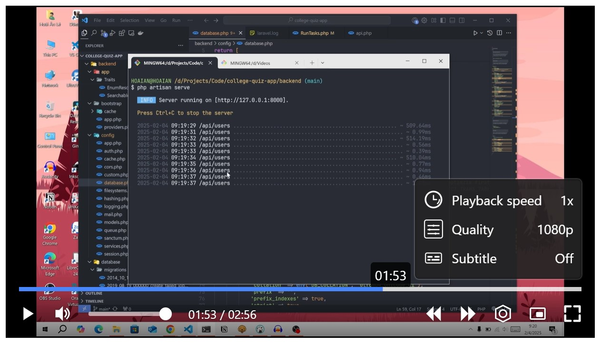

# My Video Player

## Overview

The `createVideoPlayer` function creates a custom video player with enhanced controls such as play, pause, skip, fullscreen, progress tracking, and more. This player supports multiple video sources, speed settings, and auto-hide controls for a seamless viewing experience.

## Features

- **Play & Pause**: Toggle between playing and pausing the video.
- **Skip Forward & Backward**: Jump ahead or rewind by a specified number of seconds.
- **Fullscreen Mode**: Supports fullscreen playback with optional auto-rotation to landscape mode.
- **Volume Control**: Adjustable volume settings with mute/unmute options.
- **Progress Tracking**: Displays and updates the video progress bar.
- **Playback Speed Adjustment**: Supports custom speed settings for playback.
- **Multiple Video Sources**: Allows switching between different video sources.
- **Subtitle Support**: Easily toggle subtitles on and off.
- **Auto-Hide Controls**: The controller auto-hides after a specified period of inactivity.
- **Picture-in-Picture (PiP) Mode**: Allows the video to play in a small floating window while multitasking.

## Installation

To use the custom video player, include the JavaScript function in your project and call it with the desired configuration.

### Include Required Files

Make sure to include both the JavaScript and CSS files in your project:

```html
<link rel="stylesheet" href="custom-video-player.css">
<script src="custom-video-player.js"></script>
```

If you're using ES modules, add the `export` statement to the `createVideoPlayer` function and simply import the function:

```js
import { createVideoPlayer } from './video-player.js';
```

For TypeScript users, ensure that you have the appropriate type definitions. If needed, you can define a type for the function parameters or let TypeScript infer them based on usage. Or just tell the AI do it for you.

## Usage

```js
const player = createVideoPlayer({
    // This is for switching the video source while playing. I'm not sure if it will cause errors under a slow internet connection.
    sources: [
        { src: "your-video-1080.mp4", label: "1080p" },
        { src: "your-video-720.mp4", label: "720p" },
        { src: "your-video-480.mp4", label: "480p" },
    ],
    skipSeconds: 5,
    autoHideControllerAfter: 3000, // miliseconds
    forceLandscape: true,
    enablePIP: true,
    speedSettings: [0.5, 1, 1.5, 2],
    settingLabels: {
        speed: 'Playback speed',
        source: 'Quality',
        // Not implemented yet
        caption: 'Subtitle',
    },
    // "srclang" is language code, not country code
    captions: [
        {
            src: 'caption-en.vtt',
            srclang: 'en',
            default: true,
        },
        {
            src: 'caption-ja.vtt',
            srclang: 'ja',
            default: false,
        },
        {
            src: 'caption-vi.vtt',
            srclang: 'vi',
            default: false,
        },
    ]
});

// Append to a container in the DOM
document.getElementById("video-container").appendChild(player);
```

## Configuration Options

| Option | Type | Default | Description |
|--------|------|---------|-------------|
| `sources` | Array<{src: string, label: string}> | Required | Video sources with labels. |
| `skipSeconds` | Number | `5` | Number of seconds to skip forward or backward. |
| `autoHideControllerAfter` | Number | `3000` | Time (ms) before the controls auto-hide. |
| `forceLandscape` | Boolean | `true` | Auto-rotate to landscape mode in fullscreen. |
| `enablePIP` | Boolean | `true` | Show PIP button. |
| `speedSettings` | Array<Number> | `[0.5, 1, 1.5, 2]` | Available speed options. |
| `settingLabels` | Object | `{ source: "Source", speed: "Speed", subtitle: "Subtitles" }` | Custom labels for settings. |

## Controls & Shortcuts

- **Spacebar**: Play/Pause the video.
- **Arrow Right/Left**: Skip forward/backward.
- **Up/Down Arrow**: Adjust volume.

## License

This project is licensed under the MIT License.
I created this project just for fun after watching a Korean drama. You can do anything you want with this project.

## Author

Lê Hoài Ân

## Demo

